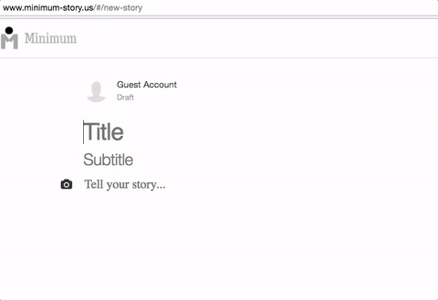

# Minimum

"Minimum" is a full-stack web application inspired by "Medium". Minimum is built using Ruby on Rails and React/Redux.

[Minimum Live][minimum]

[minimum]: http://www.minimum-story.us

## Features and Implementation

### Story CRUD

  Story CRUD is the main feature of Minimum. It utilizes RESTful Rails API with JSON response format to handle Story CRUD request from users. Each story is stored in the database with `id`, `title`, `sub_title`, `content`, `published` (a boolean value to check whether the story is published or not), `published_at`, `parent_id` (a foreign key for association to parent story), and `author_id` (also a foreign key for association to the author) columns in `Stories` table. Both `parent_id` and `author_id` are indexed for the performance improvement.

  #### Creating and Updating stories

  Writing a story is often times not easy. Especially writing a story in one seating is even more difficult. On top of that, forgetting to save your precious works ... Let's not get into that.

  Therefore, Minimum provides users with real time draft creates and updates to help the users focus on writing their cool stories without the fear of losing their work.
  Minimum provides the users with real time draft creates and updates by binding AJAX requests on user inputs, storing the drafts in the database.

  - First Minimum creates a new draft upon user input:

    Upon user inputs, you will notice that the url changes from `/new-story` to the `/stories/:storyId`:

    

  ❏	Utilizes RESTful Rails API with JSON response format to provide stateless user authentication and Story CRUD request from users
❏	Stores image uploads in the cloud using AWS S3, allowing for app scalability
❏	Binds AJAX requests on user inputs, providing real time draft creates and updates, storing the drafts in the database
❏	Created partials and common React components to keep code DRY
